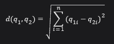
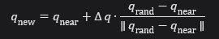

# Teoria do Algoritmo RRT

Árvore aleatória de exploração rápida (RRT - Rapidly-exploring Random Tree) é uma estrutura de dados e algoritmo que é projetado para pesquisar de forma eficiente em espaços não convexos e de alta dimensionalidade. RRTs são construidos de forma incremental de uma forma que reduz rapidamente a distância esperada de um ponto escolhido aleatoriamente para a árvore.
RRTs são particulamente adequados para problemas de planejamento de caminhos que envolvam obstáculos e restrições diferenciais.


## Explorando mais um pouco sobre o funcionamento 

O RRT explora o espaço de configuração através de amostragens aleatórias e tenta conectá-las à árvore já existente.

Aqui está uma breve descrição do método para uma configuração geral espaço, *C* (Isso pode ser considerado como um espaço de estado geral que pode incluir informações de posição e velocidade). Um RRT que está enraizado em uma configuração *q_init* e tem *K* vértices são construídos usando o seguinte algortimo:

```pseudo
BUILD_RRT(q_init, K, Δq)
1   G.init(q_init);
2   for k = 1 to K
3       q_rand ← RAND_CONF();
4       q_near ← NEAREST_VERTEX(q_rand, G);
5       q_new ← NEW_CONF(q_near, Δq);
6       G.add_vertex(q_new);
7       G.add_edge(q_near, q_new);
8   Return G
```

Destrichando esse código temos o seguinte passo a passo:

1. Uma nova árvore será gerada a partir do seu index que é o q_init.

2. Uma nova amostragem aleatória q_rand é gerada dentro do espaço livre.

3. Encontra-se o vértice mais próximo na árvore q_near.

4. Uma nova configuração q_new será feita, se movendo do q_near a uma distância incremental Δq, em direção a q_rand

5. Finalmente, um novo vértice q_new será feito, e adicionado, e um novo ponto é adicionado a q_near e q_new


Obs: Poderia ter sido colocado ou substituído RAND_CONF() por RAND_FREE_CONF(), e só colocar amostras em C_livre (utilizando um algoritmo de detecção de colisão C_obs)

### Aprofundando um pouco mais sobre a teoria do funcionamento


- **Regiões de Voronoi:** O RRT expande-se preferencialmente em direção a áreas inexploradas. A probabilidade de expansão de um estado é proporcional ao tamanho da sua região de Voronoi[1], com as maiores regiões localizadas na fronteira da busca.

- **Probabilidade de expansão:** No RRT, a probabilidade de um ponto (nó) da árvore ser escolhido para a expansão (adição de um nó) é proporcional ao tamanho da sua Região de Voronoi. Ou seja, pontos com regiões de Voronoi maiores têm mais chances de serem expandidos.

- **Viés em Direção ao Objetivo (Goal Biasing):** Para acelerar a convergência, o RRT pode ser modificado para favorecer a seleção do objetivo (q_goal​) como q_rand​. Esse viés é controlado por uma probabilidade p_goal​, que define:

  - Com probabilidade *p_goal, q_rand = q_goal*.
  
  - Com probabilidade *1 -  p_goal, q_rand* é amostrado aleatoriamente.

Esse ajuste aumenta a eficiência em problemas onde a conexão direta com o objetivo é mais provável.


- **Distância euclidiana no RRT:** A distância euclidiana é uma métrica comum utilizada no RRT para calcular a proximidade entre dois pontos no espaço de configuração. Essa distância é definida como:



Onde: 
  - q1 e q2 são os dois pontos no espaço de configuração.

  - n é o número de dimensões do espaço

**Propriedades**

  - A distância euclidiana fornece uma medida direta de "reta" entre dois pontos

  - É usado para encontrar o nó q_near mais próximo de q_rand quanto para calcular o fator de crescimento Δq

- **Fator de Crescimento(Δq):** O fator de crescimento define a distância máxima que a árvore pode se expandir em uma única iteração. Ele é calculado como: 



A escolha de Δq é crítica: valores pequenos tornam a exploração lenta, enquanto valores grandes aumentam o risco de colisões com obstáculos.


**Aplicações do RRT**

- Robótica Móvel: Planejamento de trajetórias para robôs em ambientes complexos, como em navegação autônoma.

- Manipulação Robótica: Planejamento de movimentos para braços robóticos, permitindo a realização de tarefas como agarrar objetos.

- Robôs Humanóides: Navegação em ambientes projetados para humanos, como casas e escritórios.

- Condução Autônoma: Definição de rotas eficientes e seguras para veículos autônomos.


[1] Delimita a área do espaço onde esse ponto é o mais próximo, em comparação a todos os outros pontos da árvore.