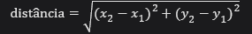
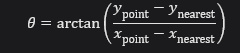
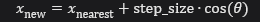
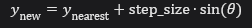
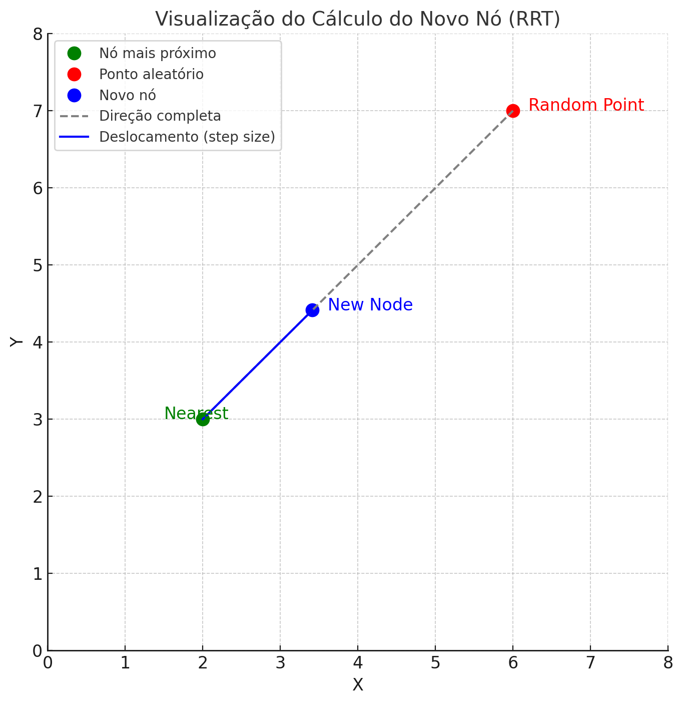

# RRT - Python

Partindo para a codificação, decidi utilizar a linguagem de programação fácil por conta do seu vasto acervo de bibliotecas e por familiaridade com a linguagem.

Claro! Vou explicar seu código em detalhes, linha por linha.

---

### **Importação de bibliotecas**

```python
import matplotlib.pyplot as plt
import random
import math
```

1. **`matplotlib.pyplot as plt`:** Usado para criar gráficos e visualizações. Neste caso, para desenhar o progresso do RRT e os obstáculos.
2. **`random`:** Fornece funções para geração de números aleatórios, útil para criar os pontos aleatórios no espaço de busca.
3. **`math`:** Inclui funções matemáticas como `hypot` (hipotenusa) e `atan2` (ângulo entre dois pontos).

---

### **Definição dos parâmetros do algoritmo**

```python
NUM_NODES = 500
STEP_SIZE = 0.5
OBSTACLES = [((3, 3), (2, 2)), ((6, 6), (1.5, 1.5)), ((1, 7), (2, 1)), ((7,8), (1,4))]
```

4. **`NUM_NODES`:** Número máximo de nós que o algoritmo RRT tentará gerar antes de parar.
5. **`STEP_SIZE`:** Distância máxima permitida entre dois nós consecutivos.
6. **`OBSTACLES`:** Lista de obstáculos representados por:
   - Uma tupla com a coordenada inicial `(x, y)` do canto inferior esquerdo.
   - O tamanho do obstáculo em largura `(w)` e altura `(h)`.

---

### **Classe Node**

```python
class Node:
    def __init__(self, x, y, parent=None):
        self.x = x
        self.y = y
        self.parent = parent
```

7. **Classe `Node`:** Representa um nó da árvore.
8. **`__init__`:** Inicializa o nó com as coordenadas `(x, y)` e uma referência ao nó "pai" (`parent`) para rastrear o caminho.

---

### **Funções auxiliares**

#### Geração de ponto aleatório

```python
def generate_random_point(xlim, ylim):
    return random.uniform(*xlim), random.uniform(*ylim)
```

9. **`generate_random_point`:** Gera um ponto `(x, y)` aleatório dentro dos limites fornecidos (`xlim` e `ylim`) usando `random.uniform`.

---

#### Distância euclidiana

```python
def distance(node1, node2):
    return math.hypot(node1.x - node2.x, node1.y - node2.y)
```

10. **`distance`:** Calcula a distância entre dois nós usando a fórmula da hipotenusa:  

   

---

#### Nó mais próximo

```python
def nearest_node(tree, point):
    return min(tree, key=lambda node: distance(node, Node(*point)))
```

11. **`nearest_node`:** Procura o nó na árvore `tree` mais próximo do ponto `point`, calculando a distância entre cada nó e o ponto dado.

---

#### Criação de novo nó

```python
def new_node(nearest, point, step_size):
    angle = math.atan2(point[1] - nearest.y, point[0] - nearest.x)
    x = nearest.x + step_size * math.cos(angle)
    y = nearest.y + step_size * math.sin(angle)
    return Node(x, y, parent=nearest)
```

12. **`new_node`:** Calcula a posição de um novo nó a partir do nó mais próximo (`nearest`) na direção de `point`, limitado pelo `step_size`.
   - `atan2`: Calcula o ângulo entre os dois pontos.
   - `cos` e `sin`: Usados para calcular a nova posição ao longo do ângulo.

---

#### Verificação de obstáculos

```python
def is_in_obstacle(point):
    px, py = point
    for (ox, oy), (w, h) in OBSTACLES:
        if ox <= px <= ox + w and oy <= py <= oy + h:
            return True
    return False
```

13. **`is_in_obstacle`:** Verifica se um ponto `(px, py)` está dentro de qualquer obstáculo da lista `OBSTACLES`.

---

### **Construção da RRT**

#### Função principal: `build_rrt`

```python
def build_rrt(start, goal, xlim, ylim):
    tree = [Node(*start)]
```

14. **`tree`:** Inicializa a árvore com o nó inicial `start`.

---

#### Configuração do gráfico

```python
    plt.figure(figsize=(8, 8))
    plt.plot(*start, 'go', markersize=12, label="Início")
    plt.plot(*goal, 'ro', markersize=12, label="Objetivo")
```

15. Desenha o gráfico com o ponto inicial (`start`) em verde e o objetivo (`goal`) em vermelho.

---

#### Desenho dos obstáculos

```python
    for (ox, oy), (w, h) in OBSTACLES:
        plt.gca().add_patch(plt.Rectangle((ox, oy), w, h, color='gray', alpha=0.5))
```

16. **`plt.Rectangle`:** Desenha cada obstáculo como um retângulo cinza no gráfico.

---

#### Loop principal

```python
    for iteration in range(1, NUM_NODES + 1):
        random_point = generate_random_point(xlim, ylim)
        if is_in_obstacle(random_point):
            continue
```

17. Gera pontos aleatórios e verifica se estão em obstáculos. Se sim, os ignora.

---

#### Criação de novos nós

```python
        nearest = nearest_node(tree, random_point)
        new = new_node(nearest, random_point, STEP_SIZE)
        if is_in_obstacle((new.x, new.y)):
            continue
```

18. Procura o nó mais próximo e tenta criar um novo nó. Ignora o nó se ele estiver em um obstáculo.

---

#### Adiciona à árvore

```python
        tree.append(new)
        plt.plot([nearest.x, new.x], [nearest.y, new.y], color='black')
```

19. Adiciona o novo nó à árvore e desenha a conexão no gráfico.

---

#### Verifica se o objetivo foi alcançado

```python
        if distance(new, Node(*goal)) < STEP_SIZE:
            goal_node = Node(*goal, parent=new)
            tree.append(goal_node)
            return tree, goal_node, iteration
```

20. Se o novo nó está próximo do objetivo, conecta o objetivo à árvore e retorna o caminho.

---

### **Extração do caminho**

```python
def get_path(node):
    path = []
    cost = 0
    while node:
        if node.parent:
            cost += distance(node, node.parent)
        path.append((node.x, node.y))
        node = node.parent
    return path[::-1], cost
```

21. Extrai o caminho do objetivo ao início, acumulando o custo total.

---

### **Visualização final**

```python
if goal_node:
    for i in range(len(path) - 1):
        x1, y1 = path[i]
        x2, y2 = path[i + 1]
        plt.plot([x1, x2], [y1, y2], 'r-', linewidth=2)
```

22. Desenha o caminho final em vermelho e destaca cada nó do caminho.

---

## Complementando a explicação do código


### **1. Extração do caminho (`get_path`)**

O objetivo da função `get_path` é reconstruir o caminho desde o nó objetivo até o nó inicial, percorrendo os pais de cada nó. Também calcula o custo total do caminho, que é a soma das distâncias entre os nós consecutivos no caminho.

#### **Código**
```python
def get_path(node):
    path = []  # Lista para armazenar os pontos no caminho
    cost = 0   # Variável para armazenar o custo total do caminho
    while node:  # Enquanto houver um nó válido
        if node.parent:  # Se o nó tiver um pai
            cost += distance(node, node.parent)  # Adiciona a distância até o pai ao custo total
        path.append((node.x, node.y))  # Adiciona as coordenadas do nó ao caminho
        node = node.parent  # Move para o nó pai
    return path[::-1], cost  # Retorna o caminho invertido (do início ao objetivo) e o custo
```

#### **Explicação detalhada**
1. **`path = []`**: Cria uma lista vazia para armazenar os nós do caminho. Cada nó é representado como um par `(x, y)`.

2. **`cost = 0`**: Inicializa o custo total do caminho como zero.

3. **`while node:`**: Um loop que percorre os nós a partir do nó objetivo até o nó inicial. Ele termina quando `node` for `None` (quando não houver mais pai).

4. **`if node.parent:`**:
   - Verifica se o nó atual tem um pai (um nó raiz não tem pai, então não precisamos calcular a distância para ele).
   - **`distance(node, node.parent)`**: Calcula a distância euclidiana entre o nó atual e seu pai.
   - **`cost += ...`**: Soma essa distância ao custo total.

5. **`path.append((node.x, node.y))`**: Adiciona as coordenadas do nó atual à lista `path`.

6. **`node = node.parent`**: Move para o nó pai, permitindo que o loop suba na árvore até chegar ao nó inicial.

7. **`path[::-1]`**: Inverte a lista `path`, já que ela foi criada do objetivo para o início, mas queremos do início para o objetivo.

8. **`return path[::-1], cost`**: Retorna o caminho e o custo.

---

### **2. Criação de um novo nó (`new_node`)**

Essa função cria um novo nó em direção a um ponto aleatório, respeitando o tamanho do passo (`STEP_SIZE`).

#### **Código**
```python
def new_node(nearest, point, step_size):
    angle = math.atan2(point[1] - nearest.y, point[0] - nearest.x)
    x = nearest.x + step_size * math.cos(angle)
    y = nearest.y + step_size * math.sin(angle)
    return Node(x, y, parent=nearest)
```

#### **Explicação detalhada**
1. **`angle = math.atan2(...)`**:
   - O `math.atan2` calcula o **ângulo** (em radianos) entre o eixo X e a linha que conecta dois pontos.
   - Argumentos: `point[1] - nearest.y` (diferença de y) e `point[0] - nearest.x` (diferença de x).
   - Isso retorna o ângulo da direção entre o ponto mais próximo (`nearest`) e o ponto aleatório (`point`).

   **Por que isso é necessário?**
   O ângulo é usado para determinar a direção correta em que o novo nó deve ser criado.

2. **`x = nearest.x + step_size * math.cos(angle)`**:
   - Move o nó mais próximo (`nearest`) uma distância `step_size` na direção do ponto aleatório.
   - O `math.cos(angle)` fornece a proporção do movimento na direção do eixo X.

3. **`y = nearest.y + step_size * math.sin(angle)`**:
   - O mesmo processo para a direção Y, usando `math.sin(angle)` para calcular a proporção do movimento no eixo Y.

4. **`return Node(x, y, parent=nearest)`**:
   - Cria um novo objeto `Node` com as coordenadas calculadas (`x`, `y`) e define o nó pai como o nó mais próximo (`nearest`).

---

### **3. Encontra o nó mais próximo (`nearest_node`)**

Essa função localiza o nó na árvore que está mais próximo do ponto aleatório gerado.

#### **Código**
```python
def nearest_node(tree, point):
    return min(tree, key=lambda node: distance(node, Node(*point)))
```

#### **Explicação detalhada**
1. **`min(tree, key=...)`**:
   - O `min` percorre todos os elementos da lista `tree` (nós da árvore) e retorna o nó que minimiza a expressão definida em `key`.

2. **`key=lambda node: ...`**:
   - O argumento `key` define como comparar os elementos da lista.
   - A função lambda recebe cada nó da árvore (`node`) e calcula sua distância até o ponto aleatório (`point`).

3. **`distance(node, Node(*point))`**:
   - Calcula a distância euclidiana entre o nó atual e o ponto aleatório. Aqui, `Node(*point)` cria um objeto `Node` temporário para representar o ponto.

4. **Como funciona?**
   - Para cada nó na árvore, a função calcula a distância até o ponto.
   - O nó com a menor distância é retornado.

---

Claro! Vamos abordar o cálculo do ângulo na criação do novo nó (`new_node`) de maneira visual e com fórmulas detalhadas para facilitar o entendimento.

---

### **Objetivo do cálculo do ângulo**

O cálculo do ângulo é necessário para mover-se **na direção do ponto aleatório** (`point`) a partir do nó mais próximo (`nearest`) enquanto respeita o comprimento do passo (`step_size`). 

O novo nó (`new_node`) será posicionado em uma linha reta entre o ponto mais próximo e o ponto aleatório.

---

### **Fórmula geral**

Dada a posição do nó mais próximo (`nearest`) com coordenadas x_near, y_near e do ponto aleatório (`point`) com coordenadas x_rand, y_rand:

1. **Cálculo do ângulo**:

   

   - Esse é o ângulo da linha que conecta os dois pontos em relação ao eixo $x$.

2. **Novas coordenadas do nó**:
   Usamos funções trigonométricas para encontrar as novas coordenadas:

   

   

Essas fórmulas deslocam o nó mais próximo em direção ao ponto aleatório, respeitando o tamanho do passo.

---

### **Exemplo prático com números**

Imagine:
- O nó mais próximo está em $(2, 3)$.
- O ponto aleatório está em $(6, 7)$.
- O tamanho do passo ($step\_size$) é 2.

1. **Diferenças entre os pontos**:
   - $ \Delta x = 6 - 2 = 4 $
   - $ \Delta y = 7 - 3 = 4 $

2. **Cálculo do ângulo**:
   - $ \theta = \arctan\left(\frac{\Delta y}{\Delta x}\right) = \arctan\left(\frac{4}{4}\right) = \arctan(1) \approx 45^\circ $ ou $0.785$ radianos.

3. **Cálculo das novas coordenadas**:
   - $ x_{\text{new}} = 2 + 2 \cdot \cos(0.785) $
     - $ \cos(0.785) \approx 0.707 $
     - $ x_{\text{new}} = 2 + 2 \cdot 0.707 = 2 + 1.414 = 3.414 $
   - $ y_{\text{new}} = 3 + 2 \cdot \sin(0.785) $
     - $ \sin(0.785) \approx 0.707 $
     - $ y_{\text{new}} = 3 + 2 \cdot 0.707 = 3 + 1.414 = 4.414 $

Resultado: o novo nó estará em $(3.414, 4.414)$.

---

### **Por que usar o ângulo?**

- O ângulo garante que o deslocamento seja na **direção correta**.
- Sem o ângulo, seria difícil calcular os deslocamentos em $x$ e $y$ proporcionalmente à direção do ponto.

---

